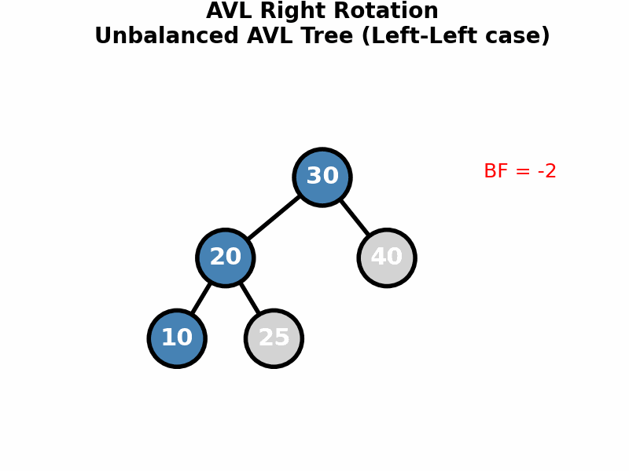
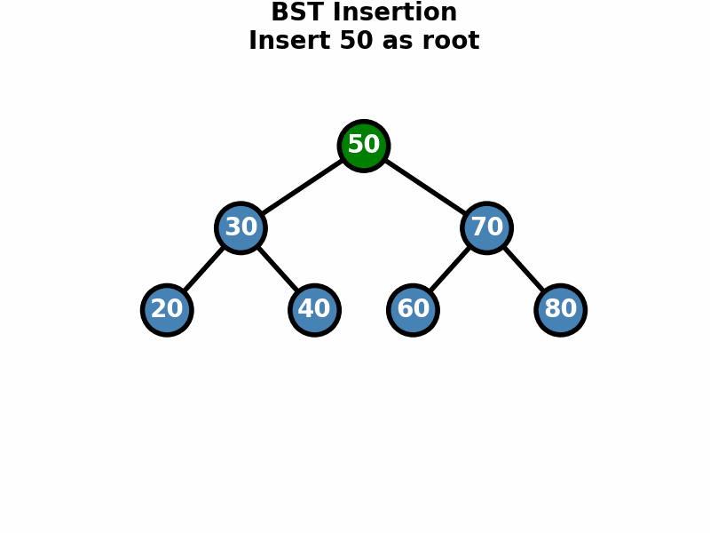

# Tier 4: Algorithms & Data Structures

The computer science foundation behind bioinformatics tools. 10 modules with 21 Jupyter notebooks, 30 interactive HTML5 visualizations, and animated GIF demonstrations.

**Study this tier alongside Tier 2 and 3** to understand _why_ the algorithms work, not just _how_ to call them.

---

## Modules

| # | Module | Notebooks | Topics |
|---|--------|-----------|--------|
| 00 | [Skills Check](00_Skills_Check/) | 1 | Self-assessment for algorithm prerequisites |
| 01 | [Complexity Analysis](01_Complexity_Analysis/) | 2 | Big-O, Big-Omega, Big-Theta, recurrences |
| 02 | [Sorting Algorithms](02_Sorting_Algorithms/) | 2 | Bubble, Selection, Insertion, Merge, Quick, Counting, Radix |
| 03 | [Searching Algorithms](03_Searching_Algorithms/) | 1 | Linear, Binary search, two-pointer |
| 04 | [Linear Data Structures](04_Linear_Data_Structures/) | 3 | Linked lists, stacks, queues, dynamic arrays |
| 05 | [Tree Structures](05_Tree_Structures/) | 3 | BST, AVL trees, Red-Black trees |
| 06 | [Hash-Based Structures](06_Hash_Based_Structures/) | 1 | Hash tables, collision resolution, Bloom filters |
| 07 | [String Algorithms](07_String_Algorithms/) | 4 | Naive, KMP, Rabin-Karp, DFA matching |
| 08 | [Advanced String Structures](08_Advanced_String_Structures/) | 4 | Tries, Aho-Corasick, suffix arrays, suffix trees |
| 09 | [Graph Algorithms](09_Graph_Algorithms/) | — | BFS, DFS, Dijkstra, Bellman-Ford, MST, topological sort |
| 10 | [Dynamic Programming](10_Dynamic_Programming/) | — | Memoization, tabulation, LCS, edit distance, knapsack |

---

## Interactive Visualizations

Open `interactive/index.html` in a browser for the full hub. Includes:

- **Sorting**: bubble, merge, quicksort race, linear sorts
- **Trees**: BST operations, AVL rotations, heap operations
- **Data structures**: linked lists, stacks/queues, hash tables
- **Strings**: pattern matching step-through, trie insertion
- **Graphs**: BFS/DFS traversal, Dijkstra shortest path, MST (Kruskal/Prim)
- **DP**: table fill visualization
- **Exercises**: 6 practice sets + 4 graded assignments (400 points total)

---

## Bioinformatics Connections

Every module here directly underpins tools used in the bioinformatics tiers:

| Algorithm Module | Bioinformatics Application | Course Notebook |
|---|---|---|
| **Dynamic Programming** (10) | Needleman-Wunsch & Smith-Waterman sequence alignment | [Pairwise Alignment](../Tier_2_Core_Bioinformatics/03_Pairwise_Sequence_Alignment/01_pairwise_sequence_alignment.ipynb) |
| **String Matching** (07) | BLAST seed-and-extend heuristic | [BLAST Searching](../Tier_2_Core_Bioinformatics/04_BLAST_Searching/01_blast_searching.ipynb) |
| **Suffix Trees/Arrays** (08) | Genome indexing (BWT, FM-index) for read alignment | [NGS Fundamentals](../Tier_3_Applied_Bioinformatics/01_NGS_Fundamentals/01_ngs_fundamentals.ipynb) |
| **Tries** (08) | k-mer counting, de Bruijn graphs for assembly | [Comparative Genomics](../Tier_2_Core_Bioinformatics/12_Comparative_Genomics/01_comparative_genomics.ipynb) |
| **Hash Tables & Bloom Filters** (06) | k-mer counting (Jellyfish), read deduplication | [NGS Fundamentals](../Tier_3_Applied_Bioinformatics/01_NGS_Fundamentals/01_ngs_fundamentals.ipynb) |
| **Trees** (05) | Phylogenetic tree construction and traversal | [Phylogenetics](../Tier_2_Core_Bioinformatics/06_Phylogenetics/01_phylogenetics.ipynb) |
| **Graphs** (09) | Metabolic pathways, gene regulatory networks | [GO and Pathways](../Tier_2_Core_Bioinformatics/11_Gene_Ontology_and_Pathways/01_gene_ontology_and_pathways.ipynb) |
| **Sorting** (02) | BAM coordinate sorting, variant prioritization | [Variant Calling](../Tier_3_Applied_Bioinformatics/02_Variant_Calling_and_SNP_Analysis/01_variant_calling_and_snp_analysis.ipynb) |
| **Complexity Analysis** (01) | Choosing efficient tools for large genomes | All Tier 2--3 notebooks |

---

## Animated Demonstrations

  
  

  
  

