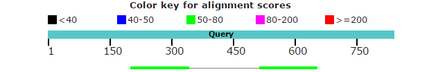
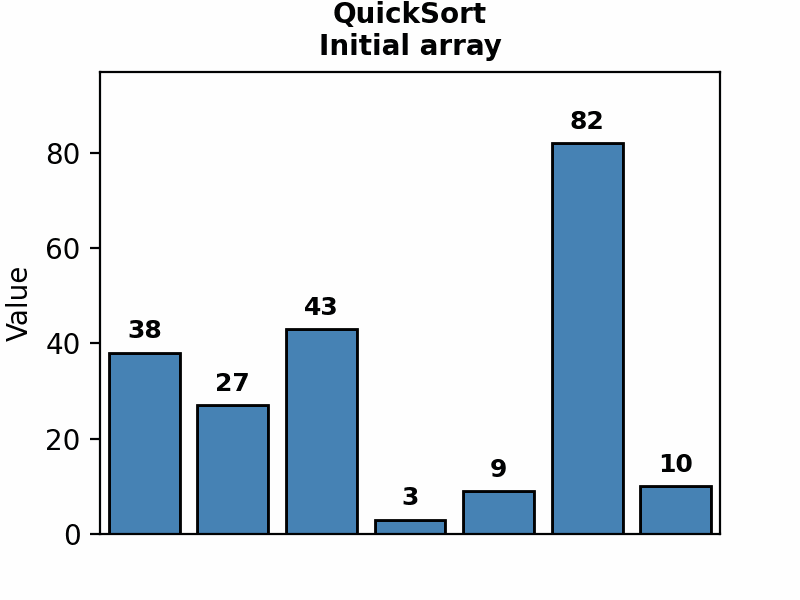

# Bioinformatics

A self-paced bioinformatics course built from materials by the [Kodomo Program](https://kodomo.fbb.msu.ru/wiki/2017) at Moscow State University, the [IAB textbook](https://readiab.org/) by J. Gregory Caporaso, and the Summer School of Bioinformatics.

**233 notebooks** · **6 tiers** · **30 interactive visualizations** · **108 glossary terms** · **[79 Claude Code skills](#claude-code-skills)**

---

## Structure

```
Tier 0  Computational Foundations      12 notebooks
        Linux · Git · Bash · Encodings · R · Biostatistics ·
        Probability & Statistics (Python) · Advanced R Statistics

Tier 1  Python for Bioinformatics      38 notebooks
        Variables → Strings → Control Flow → Functions → Files →
        Data Structures → Iterators → Regex → OOP → Decorators →
        NumPy/Pandas → Visualization → SQL

Tier 2  Core Bioinformatics            21 notebooks
        Databases · BioPython · Alignment · BLAST · MSA ·
        Phylogenetics · Protein Structure · Nucleic Acids ·
        Chromatograms · Motifs · GO/Pathways · Comparative Genomics ·
        Computational Genetics · Hi-C Analysis · Motif Discovery

Tier 3  Applied Bioinformatics         83 notebooks
        NGS · Variant Calling · RNA-seq · Microbial Diversity ·
        Promoters · Statistics · Machine Learning · Deep Learning ·
        Molecular Modeling · Clinical Genomics · Capstone Project ·
        Biochemistry & Enzyme Kinetics · Genetic Engineering ·
        Population Genetics · Numerical Methods ·
        Genome Assembly · Proteomics & Structural Methods ·
        GWAS · Spatial Transcriptomics · Copy Number Analysis ·
        Bayesian Statistics · TF Footprinting · Cancer Transcriptomics ·
        ChIP-seq & Epigenomics · Long-Read Sequencing ·
        Shotgun Metagenomics · Multi-Omics Integration ·
        Network Biology · Cheminformatics & Drug Discovery

Tier 4  Algorithms & Data Structures  30 notebooks + 30 interactive visualizations
        Complexity · Sorting · Searching · Linked Lists · Stacks/Queues ·
        BST · AVL · Red-Black Trees · Hash Tables · Bloom Filters ·
        KMP · Rabin-Karp · Tries · Suffix Trees · Graphs · DP

Tier 5  Modern AI for Science          13 notebooks
        LLM Fine-tuning · Vision RAG · Diffusion & Generative Models ·
        AlphaFold & Protein Design
```

Each tier starts with a **Skills Check** — score above 80% and skip ahead.

**Tier 4** runs in parallel with Tiers 2-3 — it provides the CS theory behind bioinformatics tools (DP = sequence alignment, string matching = BLAST, graphs = pathways).

See the full table of contents in [Course/README.md](Course/README.md), [Tier 4 README](Course/Tier_4_Algorithms_and_Data_Structures/README.md), and [Tier 5 README](Course/Tier_5_Modern_AI_for_Science/README.md).

---

## What You'll Build

- GC content calculator with sliding window
- DNA to protein translator
- FASTA file parser and analyzer
- Restriction site finder and Open Reading Frame (ORF) detector
- Gene expression heatmaps and genome GC landscape visualizer
- Sequence alignment tools with BLOSUM scoring
- BLAST result analyzer with homology assessment
- Molecular visualization scripts (Jmol/PyMol)
- DNA structure models (A/B/Z forms)
- Enzyme kinetics curve fitter (Michaelis-Menten, inhibition models)
- CRISPR guide RNA designer with off-target scoring
- Genetic drift and selection simulator
- Codon optimizer for heterologous expression
- De novo genome assembler using de Bruijn graphs
- Proteomics mass spectrum analyzer with peptide identification
- Numerical curve fitter (interpolation, FFT, least squares)

---

## Quick Start

```bash
git clone https://github.com/Pavel-Kravchenko/Bioinformatics.git
cd Bioinformatics/Course
pip install jupyter numpy pandas matplotlib seaborn biopython scikit-learn scipy
jupyter notebook
```

Not sure where to begin? Open `Tier_1_Python_for_Bioinformatics/00_Skills_Check/00_skills_check.ipynb`.

---

## Sample Data

The `Course/Assets/data/` directory contains real biological files for hands-on practice:

FASTA sequences · PDB protein structures · Sanger chromatograms (.ab1) · VCF variant calls · GenBank records · BLOSUM62 matrix

---

<p align="center">
  
  &nbsp;&nbsp;
  
  &nbsp;&nbsp;
  
</p>

<p align="center">
  
  &nbsp;&nbsp;
  
</p>
<p align="center"><em>Algorithm visualizations: QuickSort partitioning · Binary search halving</em></p>

---

## Claude Code Skills

The entire course is compressed into **79 modular skill files** for [Claude Code](https://claude.com/claude-code) — maximum knowledge density, minimum tokens. Each skill provides quick-reference tables, copy-paste code templates, and common pitfalls for a focused topic.

| Category | Skills |
|----------|--------|
| **Foundations** | `linux-git-bash` · `biostatistics-r` · `advanced-r-statistics` |
| **Python** | `python-core-bio` · `python-collections-regex` · `python-advanced-sql` · `numpy-pandas-wrangling` · `data-visualization-bio` |
| **Core Bio** | `biopython-databases` · `sequence-alignment` · `phylogenetics-evolution` · `structural-bioinformatics` |
| **Applied Bio** | `ngs-variant-calling` · `rnaseq-metagenomics` · `ml-deep-learning-bio` · `clinical-modeling-workflows` · `genome-assembly-proteomics` |
| **Algorithms** | `complexity-sorting-searching` · `linear-tree-hash-structures` · `string-algorithms` · `advanced-string-structures` · `graphs-dynamic-programming` |
| **Biology & Computation** | `probability-statistics-python` · `genetics-computational` · `biochemistry-enzymology` · `genetic-engineering-insilico` · `population-genetics-evolution` · `numerical-methods-bio` |
| **Tier 2 Depth** | `hic-analysis` · `motif-discovery` |
| **Applied Bio Depth** | `gwas-population-genetics` · `spatial-transcriptomics` · `bayesian-python` · `copy-number-analysis` · `tf-footprinting-atac` · `cancer-transcriptomics` |
| **Modern AI** | `llm-finetuning` · `vision-rag` · `diffusion-generative` · `alphafold-protein-design` |
| **New Topics** | `chipseq-epigenomics` · `long-read-sequencing` · `metagenomics-shotgun` · `multi-omics-integration` · `network-biology` · `cheminformatics-drug-discovery` |

**Usage:** Reference any skill by name in your prompt — Claude activates it automatically. See the full guide in [Skills/README.md](Skills/README.md).

---

## Acknowledgments

This course would not exist without the work of the original authors:

**[Kodomo Bioinformatics Program](https://kodomo.fbb.msu.ru/wiki/2017)** — Faculty of Bioengineering and Bioinformatics, Lomonosov Moscow State University. A 10-semester curriculum developed by A.V. Golovin, S.A. Spirin, A.V. Alekseevsky, A. Zalevsky, A.S. Zlobin, D. Penzar, Z. Chervontseva, I. Rusinov, A. Zharikova, V.E. Ramensky, V.Yu. Lunin (IMPB RAS), K.S. Mineev (IBCh RAS), O.S. Sokolova, V.D. Maslova, M. Khachaturyan, D. Dibrova, R. Kudrin, I. Diankin, E. Ocheredko, A. Demkiv, A. Ershova, and other faculty members.

**[An Introduction to Applied Bioinformatics](https://readiab.org/)** — by J. Gregory Caporaso and collaborators, Caporaso Lab, Northern Arizona University.

**Summer School of Bioinformatics** — statistical methods, NGS analysis, and promoter research materials.

**FBB Semester Materials** — Faculty of Bioengineering and Bioinformatics archive covering advanced R biostatistics (Pervushin/Muromskaya), numerical methods, genome assembly and NGS (Logacheva et al.), proteomics and physical-chemical methods, and protein engineering (Suplatov).

Full attribution details in [Course/CREDITS.md](Course/CREDITS.md).

---

## Disclaimer

**This repository is a personal study compilation for private, non-commercial educational use only.** All intellectual property rights for the original materials remain with their respective authors and institutions listed above. Materials have been translated from Russian to English and adapted solely for the purpose of personal learning.

This is not intended for redistribution, resale, or commercial use. If you are a rights holder and wish to have content removed, please open an issue and it will be addressed promptly.

---

Pavel Kravchenko
