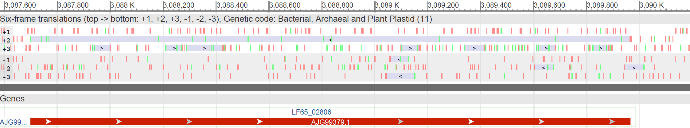
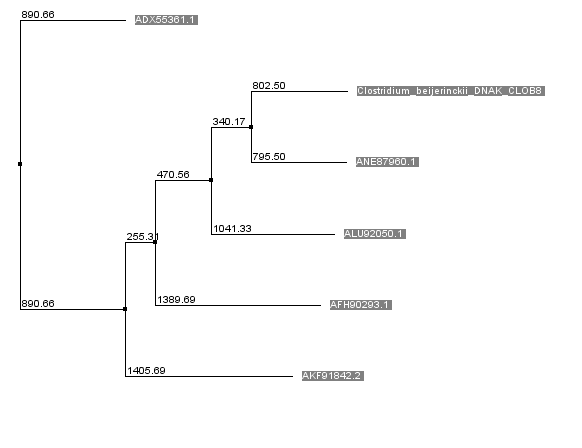

# Bioinformatics with Python

A self-paced bioinformatics course built from materials by the [Kodomo Program](https://kodomo.fbb.msu.ru/wiki/2017) at Moscow State University, the [IAB textbook](https://readiab.org/) by J. Gregory Caporaso, and the Summer School of Bioinformatics.

**82 notebooks** · **5 tiers** · **30 interactive visualizations** · **108 glossary terms**

---

## Structure

```
Tier 0  Computational Foundations       7 notebooks
        Linux · Git · Bash · Encodings · R · Biostatistics

Tier 1  Python for Bioinformatics      19 notebooks
        Variables → Strings → Control Flow → Functions → Files →
        Data Structures → Iterators → Regex → OOP → Decorators →
        NumPy/Pandas → Visualization

Tier 2  Core Bioinformatics            14 notebooks
        Databases · BioPython · Alignment · BLAST · MSA ·
        Phylogenetics · Protein Structure · Nucleic Acids ·
        Chromatograms · Motifs · GO/Pathways · Comparative Genomics

Tier 3  Applied Bioinformatics         12 notebooks
        NGS · Variant Calling · RNA-seq · Microbial Diversity ·
        Promoters · Statistics · Machine Learning · Deep Learning ·
        Molecular Modeling · Clinical Genomics · Capstone Project

Tier 4  Algorithms & Data Structures  21 notebooks + 30 interactive visualizations
        Complexity · Sorting · Searching · Linked Lists · Stacks/Queues ·
        BST · AVL · Red-Black Trees · Hash Tables · Bloom Filters ·
        KMP · Rabin-Karp · Tries · Suffix Trees · Graphs · DP
```

Each tier starts with a **Skills Check** — score above 80% and skip ahead.

**Tier 4** runs in parallel with Tiers 2-3 — it provides the CS theory behind bioinformatics tools (DP = sequence alignment, string matching = BLAST, graphs = pathways).

See the full table of contents in [Course/README.md](Course/README.md) and [Tier 4 README](Course/Tier_4_Algorithms_and_Data_Structures/README.md).

---

## Quick Start

```bash
git clone https://github.com/Pavel-Kravchenko/Bioinformatics.git
cd Bioinformatics/Course
pip install jupyter numpy pandas matplotlib seaborn biopython scikit-learn scipy
jupyter notebook
```

Not sure where to begin? Open `Tier_1_Python_for_Bioinformatics/00_Skills_Check/00_skills_check.ipynb`.

---

## Sample Data

The `Course/Assets/data/` directory contains real biological files for hands-on practice:

FASTA sequences · PDB protein structures · Sanger chromatograms (.ab1) · VCF variant calls · GenBank records · BLOSUM62 matrix

---

<p align="center">
  
  &nbsp;&nbsp;
  
  &nbsp;&nbsp;
  
</p>

<p align="center">
  
  &nbsp;&nbsp;
  
</p>
<p align="center"><em>Algorithm visualizations: QuickSort partitioning · Binary search halving</em></p>

---

## Acknowledgments

This course would not exist without the work of the original authors:

**[Kodomo Bioinformatics Program](https://kodomo.fbb.msu.ru/wiki/2017)** — Faculty of Bioengineering and Bioinformatics, Lomonosov Moscow State University. A 10-semester curriculum developed by A.V. Golovin, S.A. Spirin, A.V. Alekseevsky, A. Zalevsky, A.S. Zlobin, D. Penzar, Z. Chervontseva, I. Rusinov, A. Zharikova, V.E. Ramensky, V.Yu. Lunin (IMPB RAS), K.S. Mineev (IBCh RAS), O.S. Sokolova, V.D. Maslova, M. Khachaturyan, D. Dibrova, R. Kudrin, I. Diankin, E. Ocheredko, A. Demkiv, A. Ershova, and other faculty members.

**[An Introduction to Applied Bioinformatics](https://readiab.org/)** — by J. Gregory Caporaso and collaborators, Caporaso Lab, Northern Arizona University.

**Summer School of Bioinformatics** — statistical methods, NGS analysis, and promoter research materials.

Full attribution details in [Course/CREDITS.md](Course/CREDITS.md).

---

## Disclaimer

**This repository is a personal study compilation for private, non-commercial educational use only.** All intellectual property rights for the original materials remain with their respective authors and institutions listed above. Materials have been translated from Russian to English and adapted solely for the purpose of personal learning.

This is not intended for redistribution, resale, or commercial use. If you are a rights holder and wish to have content removed, please open an issue and it will be addressed promptly.

---

Pavel Kravchenko
